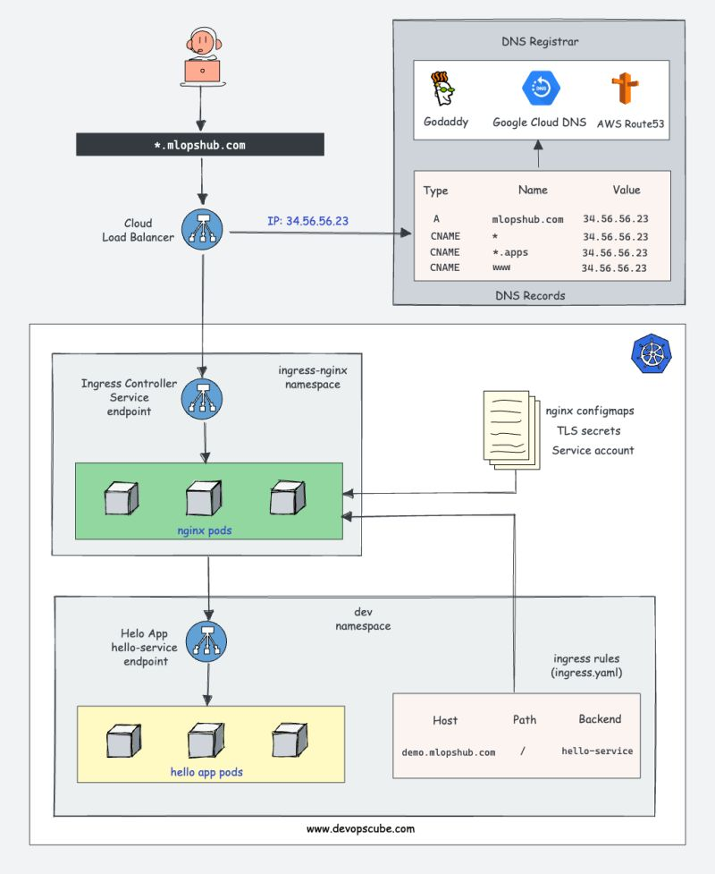

# How does a Kubernetes Ingress Controller work?

Primarily You need to be very clear about two key concepts.

- Service Discovery
- Basic Reverse Proxy Routing

𝗞𝘂𝗯𝗲𝗿𝗻𝗲𝘁𝗲𝘀 𝗜𝗻𝗴𝗿𝗲𝘀𝘀 𝗥𝗲𝘀𝗼𝘂𝗿𝗰𝗲: Kubernetes ingress resource is responsible for storing DNS routing rules in the cluster.

𝗞𝘂𝗯𝗲𝗿𝗻𝗲𝘁𝗲𝘀 𝗜𝗻𝗴𝗿𝗲𝘀𝘀 𝗖𝗼𝗻𝘁𝗿𝗼𝗹𝗹𝗲𝗿: Kubernetes Ingress Controllers, such as Nginx or HAProxy, handle the routing of traffic by utilizing the DNS rules from the Ingress Resources

You will learn the basic concepts of ingress, the native ingress resource object, and the concepts involved in ingress controllers.

- What is Kubernetes Ingress?  
- How Does Kubernetes Ingress Work?
- Kubernetes Ingress Resource
- Kubernetes Ingress Controller
- How Does an Ingress Controller Work?
- Ingress & Ingress Controller Architecture
- List of Kubernetes Ingress Controller

𝗗𝗲𝘁𝗮𝗶𝗹𝗲𝗱 𝗕𝗹𝗼𝗴: https://lnkd.in/gpbxpyZu

𝗡𝗼𝘁𝗲: The successor to Ingress is the Extensible Gateway API, which supports a variety of routing options and offers granular control. I will cover the Gateway API in a separate blog post

